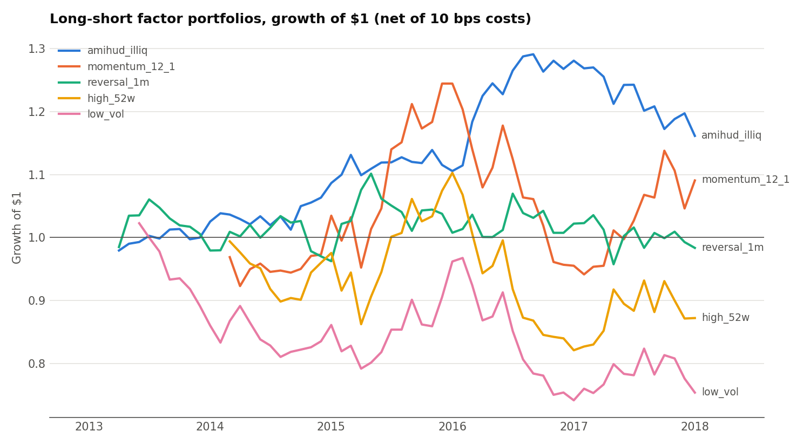
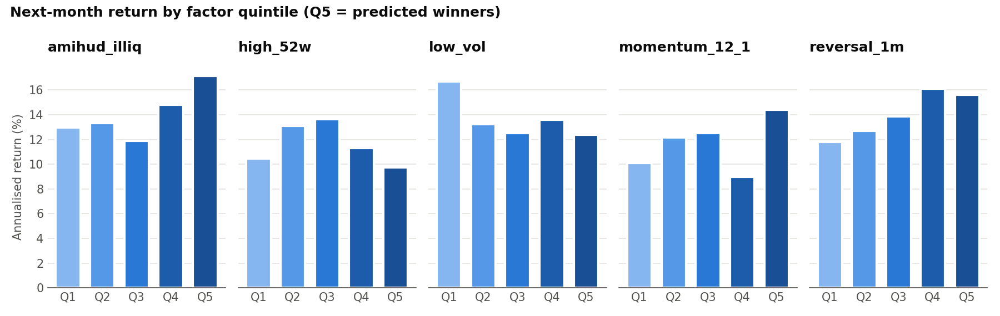
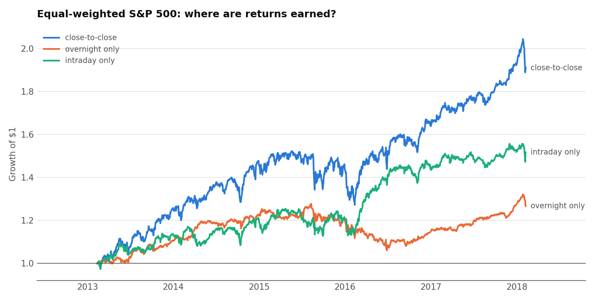

# Equity Factor Research & Backtesting in SQL

An end-to-end quantitative equity research pipeline written almost entirely in **SQL (DuckDB)**: data cleaning, return construction, risk analytics, cross-sectional factor research, a transaction-cost-aware long-short backtest, a statistical-arbitrage pairs strategy, and calendar-anomaly tests. It runs on 619,040 rows of daily S&P 500 prices from Kaggle.

The full pipeline runs in **~2 seconds** and has **11 automated validation checks** (look-ahead bias, portfolio weights, data integrity).



## Dataset

[S&P 500 stock data](https://www.kaggle.com/datasets/camnugent/sandp500) (Kaggle, `camnugent/sandp500`): daily OHLCV for 505 tickers, 2013-02-08 to 2018-02-07 (1,259 trading days).

## Quick start

```bash
python -m venv .venv && source .venv/bin/activate
pip install -r requirements.txt
python run.py          # downloads data, runs all SQL, validates, writes results/
```

## Pipeline

| File | What it does | SQL techniques |
|---|---|---|
| [01_load_and_clean.sql](sql/01_load_and_clean.sql) | Staging, trading calendar, data-quality flags and report | `LAG`/`LEAD`, `DENSE_RANK`, `FILTER`, audit tables |
| [02_returns.sql](sql/02_returns.sql) | Daily, overnight and intraday returns; equal-weighted index; monthly compounding | log-return compounding `EXP(SUM(LN(1+r)))`, running sums |
| [03_risk_metrics.sql](sql/03_risk_metrics.sql) | Vol, Sharpe, Sortino, beta, alpha, idiosyncratic vol, VaR/CVaR, skew, kurtosis, max drawdown; rolling 63d vol and 252d beta | `REGR_SLOPE`, `QUANTILE_CONT`, windowed aggregates with `ROWS BETWEEN` |
| [04_factors.sql](sql/04_factors.sql) | 5 factors formed at month-end, quintile sorts, rank IC | `NTILE`, `RANK`, Spearman IC via `CORR` of ranks, `UNION ALL` long format |
| [05_backtest.sql](sql/05_backtest.sql) | Long Q5 / short Q1 portfolios, turnover, 10 bps costs, performance stats | `FULL OUTER JOIN` for turnover, `PIVOT`, drawdown via running max |
| [06_pairs_trading.sql](sql/06_pairs_trading.sql) | Screens 111k pairs, fits hedge ratio, AR(1) half-life, trades z-score out of sample | self-join, `LAST_VALUE … IGNORE NULLS` for state (gaps-and-islands) |
| [07_anomalies.sql](sql/07_anomalies.sql) | Overnight vs intraday, day-of-week, turn-of-month, with t-stats | `ISODOW`, `DAYNAME`, conditional aggregation |
| [99_validation.sql](sql/99_validation.sql) | Assertions the runner enforces | |

## Data quality

The raw data has problems that would corrupt any backtest if left in:

| Issue | Rows | Handling |
|---|---:|---|
| Spin-offs showing as crashes (EBAY/PYPL −57%, NI −63%, BAX −44%, DISCA/DISCK) | 5 | return set to NULL |
| Bad ticks: spike that fully reverts next day (LNT, and MRO/NWL/FLR all on 2017-09-14, pointing to a vendor glitch) | 4 (+4 reversals) | both days' returns set to NULL |
| Missing open/high/low | 11 | excluded from overnight/intraday returns |
| Gaps vs trading calendar | 17 | multi-day return set to NULL |
| Inconsistent OHLC bars / zero volume | 12 / 4 | flagged, close kept |

Every overridden return is logged in `dq_overridden_returns` for audit.

## Results

**Market (equal-weighted, 2013–2018):** 13.8% annual return, 12.7% volatility, Sharpe 1.09, max drawdown −16.4%.

**Factor backtest:** monthly rebalance, long top quintile / short bottom quintile, ~98 stocks per leg, 10 bps one-way costs.

| Factor | Gross ann. | Net ann. | Sharpe (net) | t-stat | Monthly turnover | Max DD | Mean rank IC |
|---|---:|---:|---:|---:|---:|---:|---:|
| Amihud illiquidity | 4.2% | 3.3% | 0.51 | 1.11 | 70% | −10.0% | 0.018 |
| Momentum 12-1 | 4.3% | 3.2% | 0.23 | 0.45 | 94% | −24.3% | 0.012 |
| 1-month reversal | 3.8% | 0.0% | 0.00 | 0.01 | 315% | −13.0% | 0.025 |
| 52-week high | −0.8% | −2.6% | −0.19 | −0.38 | 153% | −25.5% | −0.007 |
| Low volatility | −4.3% | −5.4% | −0.47 | −1.01 | 88% | −27.5% | −0.012 |



**Findings**

- **No factor is statistically significant** (|t| < 2 everywhere). Classic anomalies are weak in a 5-year, large-cap, heavily arbitraged universe, so the right conclusion is "no evidence," not "found alpha."
- **Transaction costs decide profitability.** Short-term reversal has the highest IC (0.025) and +3.8% gross, but 315% monthly turnover takes it to 0.0% net.
- **Low volatility lost money** in the 2013–2017 bull market. The low-vol leg is also low-beta, so it lagged a rising market (corr to market −0.53); a beta-neutral version would isolate the pure effect.
- **The highest-beta stocks had the lowest Sharpe** (0.48, against 0.64–0.65 for the middle quintiles), consistent with the "betting against beta" anomaly.

**Pairs trading (out-of-sample 2017–2018):** 472 stocks were screened into 111,156 pairs and ranked by return correlation. The top 200 were narrowed to 123 with a mean-reversion half-life of 5–60 days, and the 20 most correlated of those were traded. The portfolio was flat: −0.1% annual, Sharpe −0.10, correlation to market 0.09. Selection is dominated by utilities (CMS, XEL, WEC, DTE) and regional banks. The worst pair, SCG/XEL (−24%), comes from SCANA abandoning its nuclear project in 2017, a structural break that a stop-loss or cointegration re-test would catch.

**Anomalies:** overnight returns were 5.0% a year and intraday 8.9% a year. No day-of-week or turn-of-month effect is significant; Monday is the only day with a negative mean (−3.4 bps, t = −0.62).



## Methodology notes and limitations

- **No look-ahead:** signals use data up to the close of month *t* and are evaluated on month *t+1*. Pairs are selected and z-scores normalised with 2013–2016 data only, then traded in 2017–2018. Both rules are enforced in `99_validation.sql`.
- **Survivorship bias:** the universe is S&P 500 members as of 2018, so companies that failed or were removed before then are missing, which inflates long-only returns. A production study would use point-in-time index membership.
- **Equal-weighted:** the dataset has no market caps, so the index and portfolios are equal-weighted, which tilts toward smaller members.
- **Simplifications:** zero risk-free rate (T-bills < 1% over the period); turnover ignores intra-month weight drift; no shorting costs or market impact.
- **Next steps:** a beta-neutral low-vol factor, multi-factor combination, Newey-West t-stats, cointegration (Engle-Granger) tests for pairs, and stop-losses.

## Project structure

```
sql/        numbered SQL pipeline (the core of the project)
run.py      orchestration: download → run SQL → validate → export
results/    CSV result tables and charts (generated)
```
